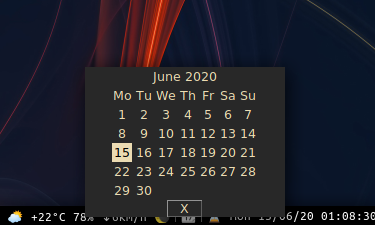

# i3blocks_calendar
A GUI pop-up calendar for i3blocks written in Python.

# Requirements
* You need i3blocks. For Arch Linux use **sudo pacman -S i3blocks**
* You also need Python3. For Arch Linux use **sudo pacman -S python**
* For GUI you need **tkinter**. Use **sudo pacman -S tk** or **pip install tkinter**
* Since the python scripts uses your mouse position to display the calendar, it uses the **pymouse** package.
  * For this, simply use **pip install PyUserInput**.

# Sample i3blocks code
Here the **[time]** block is just something I use, it is not necessary for the script.
<pre>
[calendar]
full_text=📆
command=python3 $HOME/<b>path_to_the_script</b>/calendar_gui.py

[time]
label=⏳ 
command=date +"%a %d/%m/%y %T"
interval=1
</pre>

# How it looks
Click the Calendar emoji for the script to work. If emojis are not installed, you can change it to text. It should still work.

# Todo
* Clean the code
* Add previous and next months
* Provide the user easier customization
